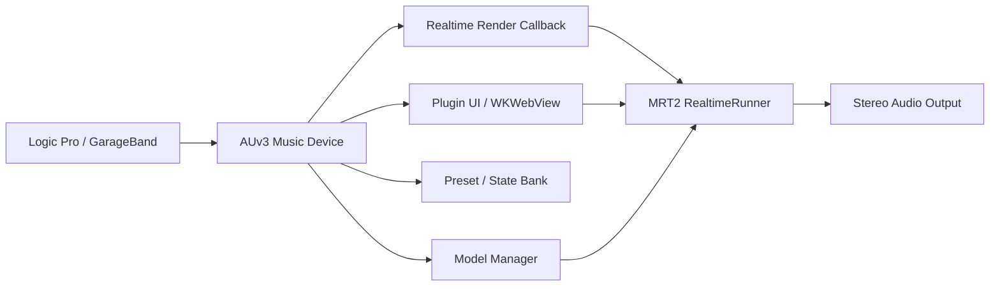
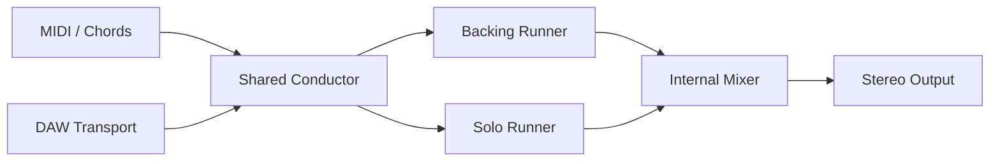

# MRT2 AUv3 插件设计草案

## 目标

把 Magenta RealTime 2 做成 Logic Pro 和 macOS 版库乐队中可加载的 AUv3 软件乐器插件。第一版目标不是完整多轨工作站，而是一个稳定、可演奏、能跟随 DAW transport 的 AI jam instrument。

## 插件形态

推荐第一版做成 AUv3 Music Device：

- 接收 DAW 的 MIDI note/control 输入。
- 读取 DAW 的播放状态、BPM、拍号和小节位置。
- 使用 MRT2 base 模型实时生成 stereo audio。
- 在 DAW 中作为软件乐器轨道加载。
- 通过宿主 app 安装、注册插件并管理模型资源。

当前项目已有 AUv3 示例，路径为 `examples/mrt2/auv3`。构建目标为 `deploy_mrt2_au`，产物为 `~/Applications/MRT2 (AU).app`，插件扩展嵌入在 app 的 `Contents/PlugIns/MRT2_AU.appex` 中。

## 第一版 MVP

第一版建议只做一个核心工作流：

1. 用户在 Logic Pro 或库乐队中新建软件乐器轨道。
2. 插入 MRT2 AUv3 插件。
3. 插件加载 `mrt2_base` 模型。
4. 用户输入整体 prompt。
5. DAW 播放时，插件按 48 kHz 实时输出 stereo audio。
6. 用户用 MIDI 键盘或 MIDI region 控制生成方向。
7. prompt、reset、seed、state bank 可以保存进 DAW 工程。

第一版不建议一开始实现多输出 stem、完整多轨编曲、MIDI 生成或复杂路由。

## 架构

### Host

宿主提供：

- MIDI note 和 controller 输入。
- 播放/停止状态。
- BPM、拍号、小节位置。
- 插件参数 automation。
- 工程保存/恢复。

### AUv3 插件

插件负责：

- 暴露 AU 参数，例如 temperature、top-k、prompt adherence、note adherence、volume、mute、latency compensation。
- 接收 MIDI，并转换成 MRT2 的 note conditioning。
- 从 host musical context 获取 BPM 和小节位置。
- 把 reset、prompt change、state restore 量化到小节或拍点。
- 把生成出的音频写入 DAW 的 output buffer。

### Realtime Engine

`RealtimeRunner` 负责模型推理和音频生成。音频线程中只能做实时安全操作：

- 读取已经准备好的音频 frame。
- 写入输出 buffer。
- 处理轻量 MIDI 事件。
- 读取 atomic 参数。

以下操作不能发生在 audio render callback 中：

- 模型加载。
- prompt 编码。
- 文件下载。
- 大块内存分配。
- UI 通信阻塞。
- 磁盘读写。

## 同步设计

MRT2 输出的是完整音频波形，不是 MIDI。因此 BPM 和和声对齐不能像 MIDI sequencer 那样做到每个音符完全可编辑。第一版应该采用“宿主 transport + 和弦条件 + 小节量化”的同步策略。

### BPM

- 从 AU host musical context 读取当前 BPM。
- 插件内部维护 beat position 和 bar position。
- prompt change、reset、state restore 默认量化到下一小节。
- 插件报告 latency，方便宿主做延迟补偿。

### 和声

可支持三种输入方式：

- MIDI 键盘实时输入和弦。
- DAW MIDI region 提供和弦轨。
- 插件内置 chord pads / chord timeline。

多 engine 场景下，所有 runner 必须共享同一个和弦状态和 transport 状态。

## Backing + Solo 设计

第二阶段可以做成一个插件内的双 lane 结构：

### Backing Runner

- 负责持续伴奏 jam。
- prompt 更偏 rhythm section、texture、groove。
- 可以较低音量常开。

### Solo Runner

- 负责 lead、solo、call-and-response。
- 更强响应 MIDI note。
- 可以启用 MIDI gate：只有用户演奏或 MIDI region 存在时才发声。

### Internal Mixer

需要提供：

- backing volume。
- solo volume。
- mute。
- solo。
- optional ducking。
- reset all / reset backing / reset solo。

第一版 Backing + Solo 建议仍然只输出 stereo mix。Logic 专用多输出可以作为后续版本。

## 多轨 Prompt 方案

### 方案 A：多插件实例

每个 DAW 轨道加载一个 MRT2 AU 实例：

- Track 1: drums prompt。
- Track 2: bass prompt。
- Track 3: pad prompt。
- Track 4: lead prompt。

优点：

- 符合 DAW 原生工作流。
- 混音、mute、solo、automation 全交给 DAW。
- 插件内部复杂度低。

缺点：

- 多个 `mrt2_base` 实例会增加 GPU/内存压力。
- 多实例之间默认不共享和弦状态。
- 如果需要严格同步，要额外实现 shared conductor。

### 方案 B：单插件多 lane

一个 AU 插件内部包含多个 prompt lane 和多个 runner，然后内部混音。

优点：

- 共享 transport、和弦、小节 reset。
- UI 更像一个完整 jam 乐器。
- 更容易做 Backing + Solo。

缺点：

- 插件复杂度高。
- 多 runner 对性能压力大。
- GarageBand 不适合作为复杂多输出宿主。

### 推荐路线

先做方案 A 的可用单实例，再做方案 B 的 Backing + Solo。真正多轨、多输出、共享 conductor 放到第三阶段。

## 资源与权限

AUv3 插件运行在宿主进程/扩展环境里，需要谨慎处理模型文件访问：

- 模型建议仍放在 `~/Documents/Magenta/magenta-rt-v2`。
- 宿主 app 负责模型下载和路径选择。
- 插件通过 security-scoped bookmark 或共享容器读取模型。
- Web UI 使用 WKWebView 时需要正确的 sandbox entitlement。
- Metal library 需要随 AU extension 一起打包。

## 性能策略

第一版使用 `mrt2_base`，但需要明确性能边界：

- 单实例 base 是 MVP 基线。
- 双 runner Backing + Solo 需要单独 profiling。
- 多轨多实例应限制默认 polyphony/lane 数。
- UI 里应显示 inference load、buffer underrun、audio level。
- 所有模型切换都必须在后台线程完成，并给出 loading 状态。

## 验收标准

第一版完成时应满足：

- `deploy_mrt2_au` 能成功构建。
- `MRT2 (AU).app` 能安装到 `~/Applications`。
- `pluginkit` 能看到 `com.google.mrt2.au`。
- Logic Pro 能扫描并加载插件。
- GarageBand 能作为软件乐器加载插件。
- DAW 工程 48 kHz 下能稳定出声。
- MIDI 输入能影响生成。
- 播放/停止不会导致崩溃。
- prompt 修改不会阻塞音频线程。
- 保存并重新打开工程后，插件状态可以恢复。

## 开发路线

### Phase 0：验证官方 AUv3 示例

- 构建 `deploy_mrt2_au`。
- 验证签名、注册、宿主扫描。
- 在 Logic/GarageBand 中手动加载。

### Phase 1：AI Jam Instrument

- 固定支持 `mrt2_base`。
- 整理模型选择和 prompt UI。
- 支持 MIDI note conditioning。
- 支持 host BPM 和 transport。
- 支持基础参数 automation。
- 支持 preset/state 保存。

### Phase 2：Backing + Solo

- 插件内部两个 runner。
- 共享 transport 和和弦状态。
- 内部 stereo mixer。
- solo MIDI gate。
- 小节级 reset/prompt change。

### Phase 3：多轨扩展

- 多插件实例共享 conductor。
- 或单插件多 lane。
- Logic 专用多输出/stem。
- 更完整的和弦时间线与 automation。

## 当前结论

这个项目可以做成 Logic Pro/GarageBand 里的 AUv3 插件。第一版应该收敛为稳定的 AI jam instrument：一个插件实例、一个 base 模型、stereo 输出、MIDI 控制、host transport 同步。等这个核心体验稳定后，再扩展 Backing + Solo 和多轨 prompt。
